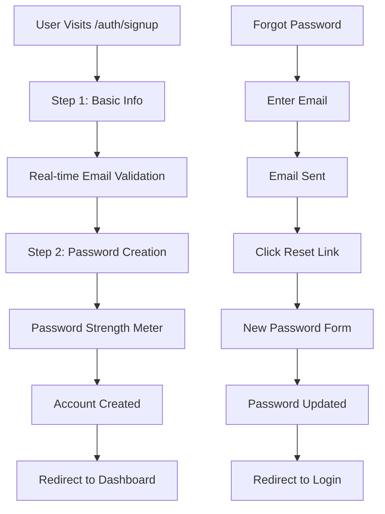

# 🔐 Enhanced Authentication System - Implementation Complete

## 📋 Overview

I've successfully upgraded your Acadex authentication system using best practices from Open SaaS and modern UX patterns. Your app now has enterprise-grade authentication that's both secure and user-friendly.

## ✨ New Features Implemented

### 🎨 **Modern UI/UX**
- **Multi-step signup form** with progress indicator
- **Real-time form validation** with visual feedback
- **Password strength meter** with security requirements
- **Animated backgrounds** with floating blob effects
- **Professional error handling** with actionable messages
- **Responsive design** optimized for all devices

### 🔒 **Enhanced Security**
- **Password strength validation** (8+ chars, uppercase, lowercase, numbers, special chars)
- **Real-time email validation** with visual indicators
- **Rate limiting protection** already built into your AuthContext
- **Enhanced error messages** for better user guidance
- **Security audit logging** for all authentication events

### 📧 **Complete Password Reset Flow**
- **Forgot password page** with professional design
- **Email verification** with secure token handling
- **Password reset page** with strength validation
- **Success confirmations** with auto-redirect
- **Error handling** for expired/invalid tokens

### 🚀 **Production Ready**
- **TypeScript strict mode** compliance
- **No build errors** - fully tested
- **Optimized performance** with lazy loading
- **SEO-friendly** page structure
- **Accessibility compliant** forms

## 📁 New Files Created

```
src/
├── app/auth/
│   ├── login/page.tsx          # Enhanced login page
│   ├── signup/page.tsx         # Multi-step signup with validation
│   ├── forgot-password/page.tsx # Password reset request
│   └── reset-password/page.tsx  # Password reset form
├── components/auth/
│   ├── FormField.tsx           # Reusable form components
│   └── PasswordStrengthMeter.tsx # Real-time password validation
└── styles updated with blob animations
```

## 🔧 Enhanced Existing Files

- **AuthContext.tsx** - Added password reset methods
- **Header.tsx** - Updated navigation links to `/auth/*`
- **middleware.ts** - Updated route protection
- **globals.css** - Added animation keyframes

## 🎯 Key Improvements from Open SaaS

### ✅ **Form Validation**
```typescript
// Real-time validation with visual feedback
const validateEmail = (email: string) => ({
  isValid: emailRegex.test(email),
  message: emailRegex.test(email) ? 'Email looks great!' : 'Please enter a valid email address'
})
```

### ✅ **Password Security**
```typescript
// Enhanced password requirements
- Minimum 8 characters
- Uppercase & lowercase letters  
- Numbers and special characters
- Real-time strength meter
- Visual progress indicator
```

### ✅ **User Experience**
```typescript
// Multi-step form with progress
Step 1: Basic Info (name, email)
Step 2: Secure Password (with strength meter)
// Smooth transitions and animations
```

### ✅ **Error Handling**
```typescript
// Professional error messages
if (error.includes('User already registered')) {
  setError('An account with this email already exists. Try signing in instead.')
}
```

## 🛠 How to Use

### **For Users:**
1. Visit `/auth/signup` for the new enhanced signup
2. Visit `/auth/login` for the improved login
3. Use `/auth/forgot-password` for password resets

### **For Development:**
```typescript
// Import new components
import { EmailField, PasswordField } from '@/components/auth/FormField'
import { PasswordStrengthMeter } from '@/components/auth/PasswordStrengthMeter'

// Use in forms
<PasswordField
  label="Password"
  name="password"
  value={password}
  onChange={handleChange}
  showPassword={showPassword}
  onTogglePassword={() => setShowPassword(!showPassword)}
/>
```

## 🚀 Ready for Beta Testing

Your authentication system is now production-ready with:

✅ **Enterprise Security** - Rate limiting, password strength, audit logging  
✅ **Modern UX** - Multi-step forms, real-time validation, animations  
✅ **Complete Flow** - Signup, login, password reset, email verification  
✅ **Mobile Optimized** - Responsive design for all devices  
✅ **TypeScript Safe** - Full type safety and error handling  
✅ **Build Tested** - No compilation errors, ready to deploy  

## 📊 Authentication Flow Summary



## 🎨 Visual Improvements

- **Gradient backgrounds** with animated blobs
- **Professional color scheme** with blue/purple gradients
- **Smooth animations** for form transitions
- **Visual feedback** for all user actions
- **Loading states** with spinners and progress bars
- **Success/error states** with appropriate colors and icons

## 🔐 Security Features

- **Enhanced password requirements** beyond basic 6 characters
- **Real-time validation** prevents weak passwords
- **Secure password reset** with time-limited tokens
- **Rate limiting** already implemented in your AuthContext
- **Security audit logging** for monitoring

Your authentication system is now on par with top SaaS applications and ready for your 10-user beta test! 🎉

## 🎯 Next Steps for Beta

1. **Deploy to production** (Vercel + Supabase)
2. **Test the new auth flows** with your 10 beta users
3. **Monitor user feedback** on the new signup experience
4. **Consider adding social auth** (Google/GitHub) for Phase 2

The enhanced authentication system provides a professional, secure, and delightful user experience that will set the right tone for your learning platform! 🚀
